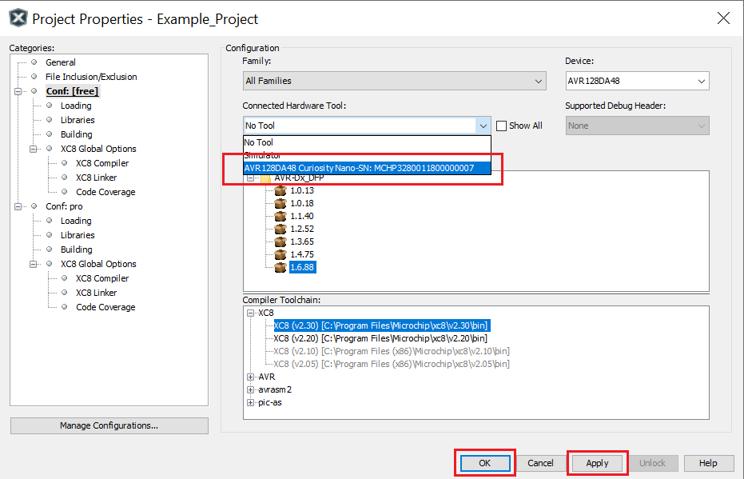
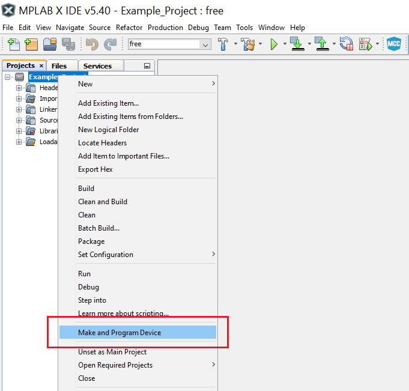

# How to Program an MPLAB® X IDE Project for AVR®

This page demonstrates how to use the MPLAB® X IDE to program an AVR® device with an Example_Project.X. This can be applied for any other projects.

## Operation

1.  Connect the board to the PC.

2.  Open the Example_Project.X project in MPLAB X IDE.

3.  Set the Example_Project.X project as main project. Right click on the project in the **Projects** tab and click **Set as Main Project**.

 

4.  Clean and build the Example_Project.X project. Right click on the **Example_Project.X** project and select **Clean and Build**.

 

5.  Select the **AVRxxxxx Curiosity Nano** in the Connected Hardware Tool section of the project settings:

- Right click on the project and click **Properties**
- Click on the arrow under the Connected Hardware Tool
- Select the **AVRxxxxx Curiosity Nano** (click on the **SN**), click **Apply** and then click **OK**:

 

6.  Program the project to the board. Right click on the project and click **Make and Program Device**.

 

## Summary

These are all the steps needed to program an Example_Project.X project in MPLAB X IDE.
