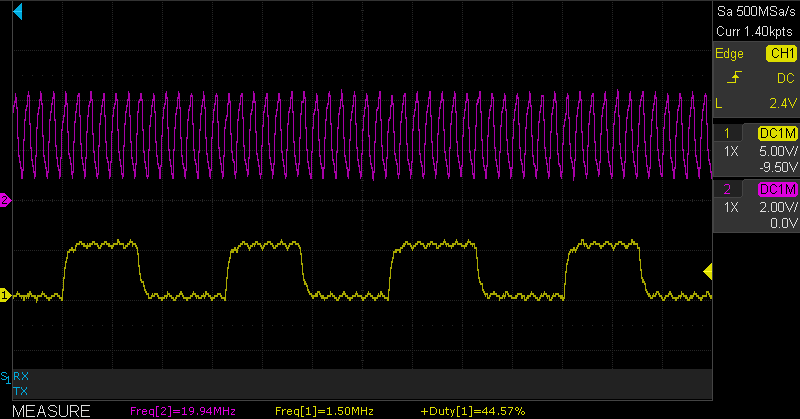

 # AVR128DA48 TCD Dithering Code Example

This example demonstrates how to use the Timer/Counter type D (TCD) dithering feature. If it is not possible to achieve the desired frequency, dithering can be used to approximate the desired frequency and reduce the waveform drift. The dither accumulates the fractional error of the counter clock for each cycle. When the fractional error overflows, an additional clock cycle is added to the selected part of the TCD cycle.

## Related Documentation
More details and code examples on the AVR128DA48 can be found at the following links:
- [TB3212 - Getting started with TCD](https://www.microchip.com/wwwAppNotes/AppNotes.aspx?appnote=en609129)
- [AVR128DA48 Product Page](https://www.microchip.com/wwwproducts/en/AVR128DA48)
- [AVR128DA48 Code Examples on GitHub](https://github.com/microchip-pic-avr-examples?q=avr128da48)
- [AVR128DA48 Project Examples in START](https://start.atmel.com/#examples/AVR128DA48CuriosityNano)

## Software Used
- MPLAB® X IDE 5.40 or newer [(microchip.com/mplab/mplab-x-ide)](http://www.microchip.com/mplab/mplab-x-ide)
- MPLAB® XC8 2.30 or a newer compiler [(microchip.com/mplab/compilers)](http://www.microchip.com/mplab/compilers)
- MPLAB® Code Configurator (MCC) 4.0.1 or newer [(microchip.com/mplab/mplab-code-configurator)](https://www.microchip.com/mplab/mplab-code-configurator)
- MPLAB® Code Configurator (MCC) Device Libraries 8-bit AVR MCUs 2.5.0 or newer [(microchip.com/mplab/mplab-code-configurator)](https://www.microchip.com/mplab/mplab-code-configurator)
- AVR-Dx 1.6.88 or newer Device Pack

## Hardware Used
- AVR128DA48 Curiosity Nano [(DM164151)](https://www.microchip.com/Developmenttools/ProductDetails/DM164151)
- Oscilloscope or Logic Analyzer

## Setup
The AVR128DA48 Curiosity Nano Development Board is used as test platform.

 

The timer clock source frequency will be 20 MHz, resulting in a timer resolution of 50 ns. The desired output frequency is 1.5 MHz, which means a period of 666.(6) ns. This period cannot be achieved with a 50 ns resolution, as it would require 13.33 clock cycles. The output period can be set to either 13 cycles (650 ns, 1.54 MHz frequency) or 14 cycles (700 ns, 1.43 MHz frequency). The dither can change the period automatically by accumulating the error and adding a clock cycle to the output period. In this case, the output signal period will be 650 ns, accumulating 0.33 of a clock cycle. Every third generated cycle (dither value is 5, so that the accumulator will overflow after every three cycles), the generated signal period will become 700 ns, and the averaged period of the generated signal will be 666.66 ns. The generated signal average frequency will be 1.5 MHz, as desired. 

The following configurations must be made for this project:

- System Module:
    - Clock Source: Internal high-frequency oscillator
    - Internal Oscillator Frequency: 1-32 MHz internal oscillator
    - Oscillator Frequency Options: 20 MHz system clock
    - PLL and Prescaler disabled
    - Clock-Out Enable: Checked
- TCD:
    - Hardware Settings
        - Enable TCD: Checked
        - Clock Selection: Peripheral Clock
        - Counter Prescaler: Sync clock divided by 1
        - Synchronization Prescaler: Selected clock source divided by 1
    - Compare Settings
        - Compare B Set: 333 ns
        - Compare B Clear: 666 ns
    - Waveform Generation Settings
        - Waveform Generation Mode: One Ramp mode
    - Dither Settings
        - Dither Select: On-time ramp B
        - Dither Value: 5

Make sure the following pins are configured as outputs:

 |Pin                       | Configuration      |
 | :---------------------:  | :----------------: |
 |      PA5                 |     output         |
 |      PA7                 |     output         |

## Operation

To program the Curiosity Nano board with this MPLAB X project, follow the steps provided in the [Program.md](./Program.md) page.

## Demo

Connect the oscilloscope or logic analyzer probes to pins PA5 and PA7. 
The 20 MHz source signal is available on channel 2, and the generated 1.5 MHz signal is available on channel 1.

 

Changes in the dithered period (pulse width, duty cycle) can be observed. 

 

The averaged period and frequency of the generated signal are available in the oscilloscope screen shot below. 

 

## Summary
This application will configure the TCD instance to generate a periodic signal on channel B pin PA5 with a desired output frequency of 1.5 MHz. The timer cannot achieve this specific frequency. It will generate a signal with ~1.54 MHz and will accumulate the error for three periods. When the dither error will overflow, it will add one cycle to the TCD period value, thus obtaining ~1.43 MHZ for one period and resulting an average of 1.5 MHz output frequency.
